<h2>
Image-Segmentation-Multiple-Myeloma (Updated: 2023/05/18)
</h2>
This is an experimental project to detect <b>Multiple-Myeloma</b> based on 
Microscopic Images of Multiple-Myeloma (TCIA_SegPC_dataset), by using 
<a href="https://github.com/atlan-antillia/Tensorflow-Slightly-Flexible-UNet">
Tensorflow-Slightly-Flexible-UNet.</a> 
The original dataset used here has been take from the following  web site: 
<b>SegPC-2021-dataset</b> 
SegPC-2021: Segmentation of Multiple Myeloma Plasma Cells in Microscopic Images 
<pre>
https://www.kaggle.com/datasets/sbilab/segpc2021dataset
</pre>
Citation: 

<pre>
Anubha Gupta, Ritu Gupta, Shiv Gehlot, Shubham Goswami, April 29, 2021, "SegPC-2021: Segmentation of Multiple Myeloma Plasma Cells in Microscopic Images", IEEE Dataport, doi: https://dx.doi.org/10.21227/7np1-2q42.

BibTex
@data{segpc2021,
doi = {10.21227/7np1-2q42},
url = {https://dx.doi.org/10.21227/7np1-2q42},
author = {Anubha Gupta; Ritu Gupta; Shiv Gehlot; Shubham Goswami },
publisher = {IEEE Dataport},
title = {SegPC-2021: Segmentation of Multiple Myeloma Plasma Cells in Microscopic Images},
year = {2021} }

IMPORTANT:
If you use this dataset, please cite below publications-

1. Anubha Gupta, Rahul Duggal, Shiv Gehlot, Ritu Gupta, Anvit Mangal, Lalit Kumar, Nisarg Thakkar, and Devprakash Satpathy, 
 "GCTI-SN: Geometry-Inspired Chemical and Tissue Invariant Stain Normalization of Microscopic Medical Images," 
 Medical Image Analysis, vol. 65, Oct 2020. DOI: 
 (2020 IF: 11.148)

2. Shiv Gehlot, Anubha Gupta and Ritu Gupta, 
 "EDNFC-Net: Convolutional Neural Network with Nested Feature Concatenation for Nuclei-Instance Segmentation,"
 ICASSP 2020 - 2020 IEEE International Conference on Acoustics, Speech and Signal Processing (ICASSP), 
 Barcelona, Spain, 2020, pp. 1389-1393.

3. Anubha Gupta, Pramit Mallick, Ojaswa Sharma, Ritu Gupta, and Rahul Duggal, 
 "PCSeg: Color model driven probabilistic multiphase level set based tool for plasma cell segmentation in multiple myeloma," 
 PLoS ONE 13(12): e0207908, Dec 2018. DOI: 10.1371/journal.pone.0207908

License
CC BY-NC-SA 4.0
</pre>

<h2>
1. Installing tensorflow on Windows11
</h2>
We use Python 3.8.10 to run tensoflow 2.11.1 on Windows11. 
<h3>1.1 Install Microsoft Visual Studio Community</h3>
Please install <a href="https://visualstudio.microsoft.com/ja/vs/community/">Microsoft Visual Studio Community</a>, 
which can be ITed to compile source code of 
<a href="https://github.com/cocodataset/cocoapi">cocoapi</a> for PythonAPI. 
<h3>1.2 Create a python virtualenv </h3>
Please run the following command to create a python virtualenv of name <b>py38-efficientdet</b>.
<pre>
>cd c:\
>python38\python.exe -m venv py38-efficientdet
>cd c:\py38-efficientdet
>./scripts/activate
</pre>
<h3>1.3 Create a working folder </h3>
Please create a working folder "c:\google" for your repository, and install the python packages. 

<pre>
>mkdir c:\google
>cd    c:\google
>pip install cython
>git clone https://github.com/cocodataset/cocoapi
>cd cocoapi/PythonAPI
</pre>
You have to modify extra_compiler_args in setup.py in the following way:
<pre>
   extra_compile_args=[]
</pre>
<pre>
>python setup.py build_ext install
</pre>

 
<h2>
2. Installing Image-Segmentation-Multiple-Myeloma
</h2>
<h3>2.1 Clone repository</h3>
Please clone Image-Segmentation-Multiple-Myeloma.git in the working folder <b>c:\google</b>. 
<pre>
>git clone https://github.com/sarah-antillia/Image-Segmentation-Multiple-Myeloma.git 
</pre>
You can see the following folder <b>projects</b> in Image-Segmentation-Multiple-Myeloma of the working folder. 

<pre>
Image-Segmentation-Multiple-Myeloma
├─eval
├─mini_test
├─mini_test_output
├─models
└─MultipleMyeloma
    ├─train
    │  ├─images
    │  └─masks
    └─valid
        ├─images
        └─masks
</pre>
<h3>2.2 Install python packages</h3>

Please run the following command to install python packages for this project. 
<pre>
>cd ./Image-Segmentation-Multiple-Myeloma
>pip install -r requirements.txt
</pre>

 
<h3>2.3 Create MultipleMyeloma dataset</h3>
<h3>
2.3.1. Download 
</h3>
Please download original <b>Multiple Myeloma Plasma Cells</b> dataset from the following link.
<b>SegPC-2021-dataset</b> 
SegPC-2021: Segmentation of Multiple Myeloma Plasma Cells in Microscopic Images 
<pre>
https://www.kaggle.com/datasets/sbilab/segpc2021dataset
</pre>
The folder structure of the dataset is the following. 
<pre>
TCIA_SegPC_dataset
├─test
│  └─x
├─train
│  ├─x
│  └─y
└─valid
    ├─x
    └─y
</pre>
Each <b>x</b> folder of the dataset contains the ordinary image files of Multiple Myeloma Plasma Cells,
and <b>y</b> folder contains the mask image file to identify each Cell of the ordinary image files.
  Both the image size of all files in <b>x</b> and <b>y</b> is 2560x1920, which is apparently too large to use 
for our TensoflowUNet Model. 

Sample images in train/x: 
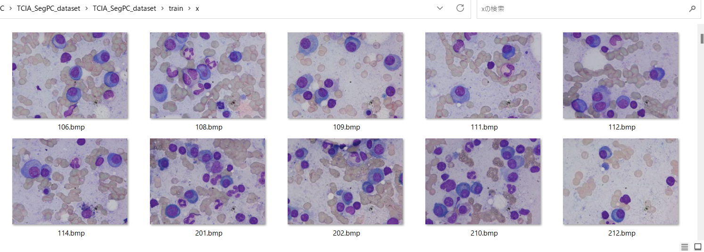 
Sample masks in train/y: 
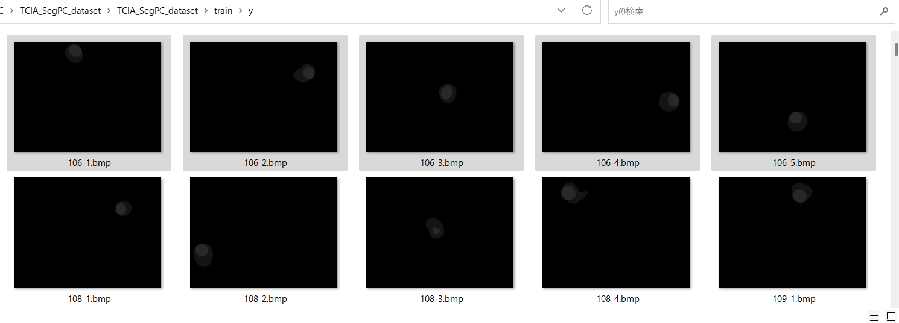 

For example, an image file <b>train/x/106.bmp</b> in the above picture has some corresponding mask files <b>train/y/106_*.bmp</b>, which contain extremely unreconizable ellipsoidal lightgray mask regions for humans. 
 
<h3>
2.3.2. Generate MultipleMyelomaImage Dataset
</h3>
 We have created Python script <a href="./MultipleMyelomaImageDatasetGenerator.py">MultipleMyelomaImageDatasetGenerator.py</a> to create images and masks dataset which may be used to train our
 TensorflowUNet model. 
 This script will perform following image processing. 
 <pre>
 1 Resize all bmp files in <b>x</b> and <b>y</b> folder to 256x256 square image.
 2 Create clear white-black mask files from the original mask files.
 3 Create cropped images files corresponding to each segmented region in mask files in <b>y</b> folders.
</pre>
There are some strategies to create cropped area to identity cell region from the original image and some mask files. 
Example: 
<li>White black mask files created by the generator script above</li>
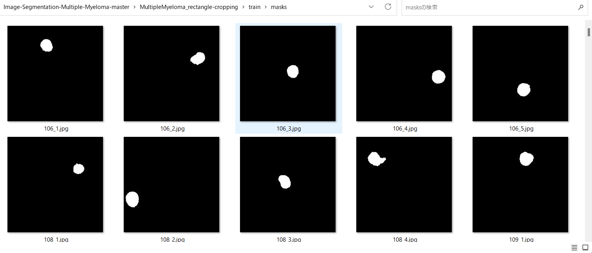 
<li>Cropping the rectangular area corresponding to the mask region.</li>
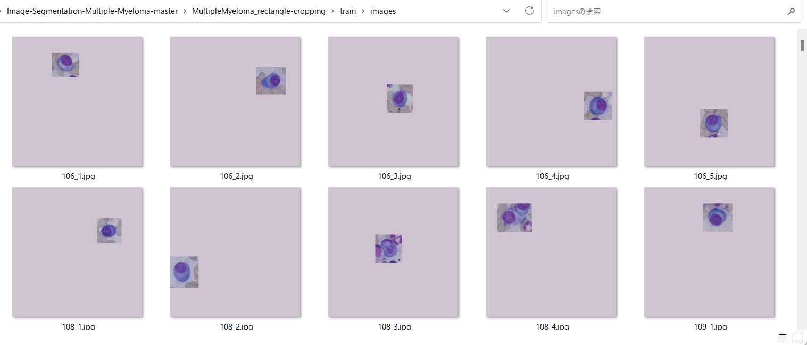 
<li>Cropping the ellipsoidal area corresponding to the mask region.</li>
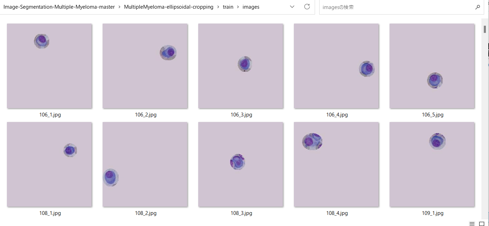 
At first glance, the second strategy seems to be well fitting to the white ellipsoidal regions of mask files, 
but we will take the first strategy, because that ordinary Tensorflow CNN Convolution and MaxPooling layers will
receive the rectangular images as their inputs.  

<h3>
2.3.3 Generated MultipleMyeloma dataset. 
</h3>
Finally, we have generated the resized jpg files dataset below.  
<pre>
MultipleMyeloma
├─train
│  ├─images
│  └─masks
└─valid
    ├─images
    └─masks
</pre>

<h2>
3 Train TensorflowUNet Model
</h2>
 We have trained MultipleMyeloma TensorflowUNet Model by using the following
 <b>train_eval_infer.config</b> file.  
Please run the following bat file. 
<pre>
>1.train.bat
</pre>
, which simply runs the following command. 
<pre>
>python TensorflowUNetMultipleMyelomaTrainer.py
</pre>
This python script above will read the following configration file, build TensorflowUNetModel, and
start training the model by using 
<pre>
; train_eval_infer.config
; 2023/5/11 antillia.com
; Added dice_loss
[model]
image_width    = 256
image_height   = 256
image_channels = 3
num_classes    = 1
base_filters   = 16
num_layers     = 6
dropout_rate   = 0.08
learning_rate  = 0.001
dice_loss      = False
show_summary   = True

[train]
epochs        = 100
batch_size    = 4
patience      = 10
metrics       = ["accuracy", "val_accuracy"]
model_dir     = "./models"
eval_dir      = "./eval"
image_datapath = "./MultipleMyeloma/train/"

[eval]
image_datapath = "./MultipleMyeloma/valid/"

[infer] 
images_dir    = "./mini_test" 
output_dir    = "./mini_test_output"

</pre>

Since <b>dice_loss</b> is set to be <b>False</b> in <b>train_eval_infer.config</b> file,
<b>binary_crossentropy</b> is used as a loss function to compile our model as shown below.
<pre>
  self.loss    = "binary_crossentropy"
  self.metrics = ["accuracy"]
  self.model.compile(optimizer = self.optimizer, loss= self.loss, metrics = self.metrics)
</pre>

We have also used Python <a href="./MultipleMyelomaDataset.py">MultipleMyelomaDataset.py</a> script to create
train and test dataset from the images and masks specified by
<b>image_datapath</b> and <b>mask_datapath </b> parameters in the configratration file. 
The training process has just been stopped at epoch 30 by an early-stopping callback as shown below.  
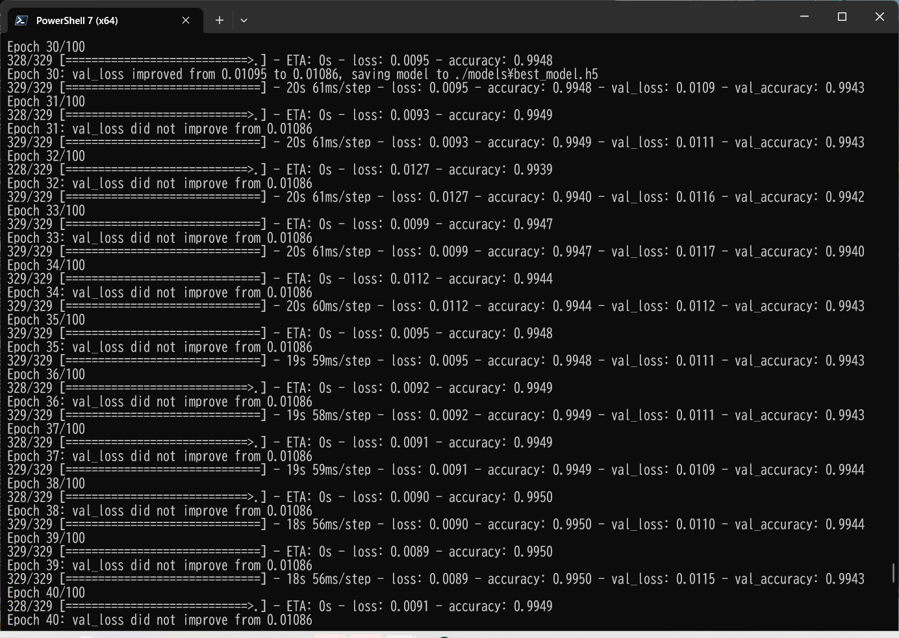 
 
The <b>val_accuracy</b> is very high as shown below from the beginning of the training. 
<b>Train accuracies line graph</b>: 
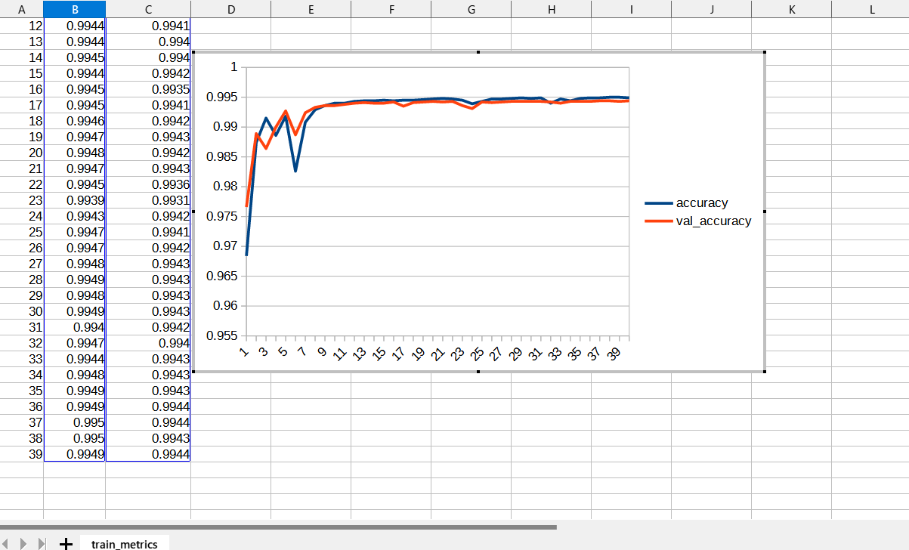 

 
The val_loss is also very low as shown below from the beginning of the training. 
<b>Train losses line graph</b>: 
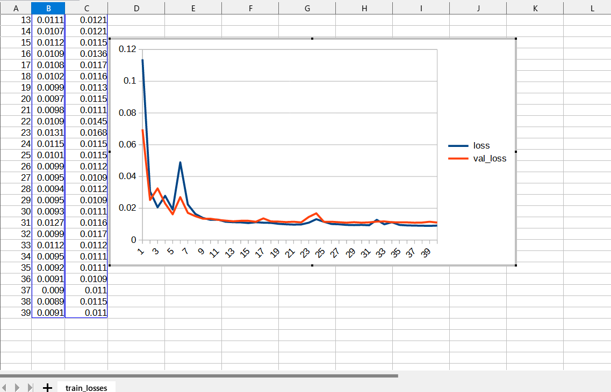 

<h2>
4 Evaluation
</h2>
 We have evaluated prediction accuracy of our Pretrained MultipleMyeloma Model by using <b>test</b> dataset.
Please run the following bat file. 
<pre>
>2.evalute.bat
</pre>
, which simply run the following command. 
<pre>
>python TensorflowUNetMultipleMyelomaEvaluator.py
</pre>
The evaluation result of this time is the following. 
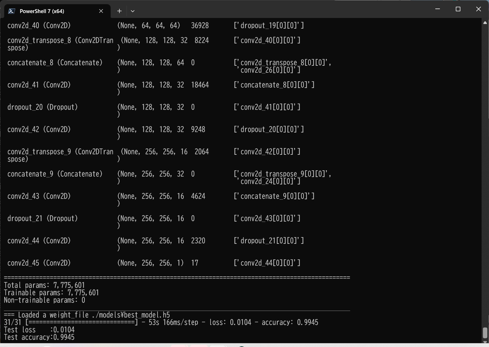 
 

<h2>
5 Inference 
</h2>
We have also tried to infer the segmented region for <b>mini_test</b> dataset, which is a very small dataset including only ten images extracted from <b>test</b> dataset,
 by using our Pretrained MultipleMyeloma Model. 
<pre>
>3.infer.bat
</pre>
, which simply runs the following command. 
<pre>
>python TensorflowUNetMultipleMyelomaInfer.py
</pre>

<b>Input images (mini_test) </b> 
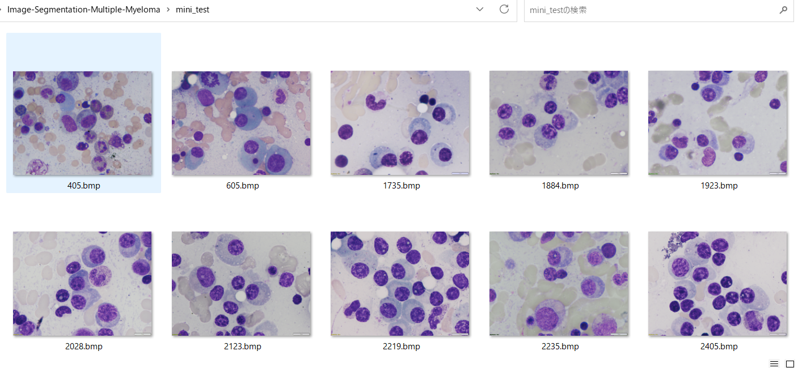 
 
<b>Infered images (mini_test_output)</b> 
Some green tumor regions in the original images of the mini_test dataset above have been detected as shown below.
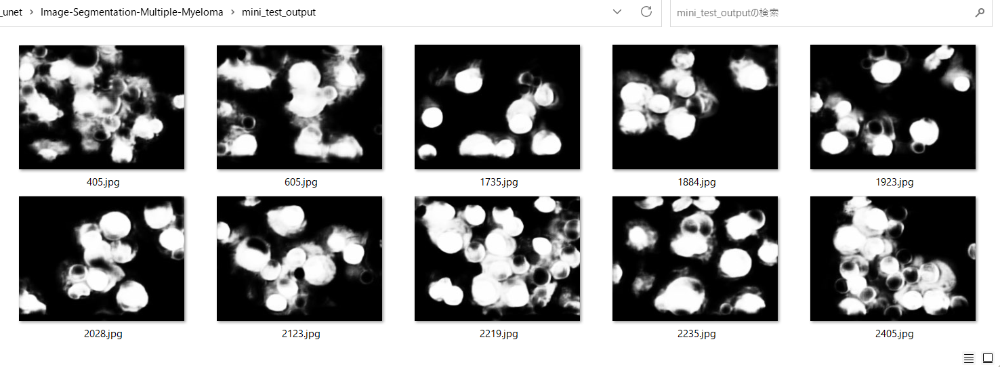  

 
<!--
-->

<h3>
References
</h3>
<b>1. SegPC-2021-dataset</b> 
SegPC-2021: Segmentation of Multiple Myeloma Plasma Cells in Microscopic Images 
<pre>
https://www.kaggle.com/datasets/sbilab/segpc2021dataset
</pre>
Citation: 
<pre>
Anubha Gupta, Ritu Gupta, Shiv Gehlot, Shubham Goswami, April 29, 2021, "SegPC-2021: Segmentation of Multiple Myeloma Plasma Cells in Microscopic Images", IEEE Dataport, doi: https://dx.doi.org/10.21227/7np1-2q42.
BibTex
@data{segpc2021,
doi = {10.21227/7np1-2q42},
url = {https://dx.doi.org/10.21227/7np1-2q42},
author = {Anubha Gupta; Ritu Gupta; Shiv Gehlot; Shubham Goswami },
publisher = {IEEE Dataport},
title = {SegPC-2021: Segmentation of Multiple Myeloma Plasma Cells in Microscopic Images},
year = {2021} }
IMPORTANT:
If you use this dataset, please cite below publications-
1. Anubha Gupta, Rahul Duggal, Shiv Gehlot, Ritu Gupta, Anvit Mangal, Lalit Kumar, Nisarg Thakkar, and Devprakash Satpathy, 
 "GCTI-SN: Geometry-Inspired Chemical and Tissue Invariant Stain Normalization of Microscopic Medical Images," 
 Medical Image Analysis, vol. 65, Oct 2020. DOI: 
 (2020 IF: 11.148)
2. Shiv Gehlot, Anubha Gupta and Ritu Gupta, 
 "EDNFC-Net: Convolutional Neural Network with Nested Feature Concatenation for Nuclei-Instance Segmentation,"
 ICASSP 2020 - 2020 IEEE International Conference on Acoustics, Speech and Signal Processing (ICASSP), 
 Barcelona, Spain, 2020, pp. 1389-1393.
3. Anubha Gupta, Pramit Mallick, Ojaswa Sharma, Ritu Gupta, and Rahul Duggal, 
 "PCSeg: Color model driven probabilistic multiphase level set based tool for plasma cell segmentation in multiple myeloma," 
 PLoS ONE 13(12): e0207908, Dec 2018. DOI: 10.1371/journal.pone.0207908
License
CC BY-NC-SA 4.0
</pre>

<b>2. Deep Learning Based Approach For MultipleMyeloma Detection</b> 
Vyshnav M T, Sowmya V, Gopalakrishnan E A, Sajith Variyar V V, Vijay Krishna Menon, Soman K P 
<pre>
https://www.researchgate.net/publication/346238471_Deep_Learning_Based_Approach_for_Multiple_Myeloma_Detection
</pre>
 

<h2>
Appendix
</h2>
<h3>Model summary</h3>
Please run the following command to see the summary of TensorflowUNet Model
defined by <b>train_eval_infer.config</b>.  
<pre>
>python TensorflowUNet.py
</pre>
<a href="./asset/model.png">Model Visualization</a>
<pre>
__________________________________________________________________________________________________
 Layer (type)                   Output Shape         Param #     Connected to
==================================================================================================
 input_1 (InputLayer)           [(None, 256, 256, 3  0           []
                                )]

 lambda (Lambda)                (None, 256, 256, 3)  0           ['input_1[0][0]']

 conv2d (Conv2D)                (None, 256, 256, 16  448         ['lambda[0][0]']
                                )

 dropout (Dropout)              (None, 256, 256, 16  0           ['conv2d[0][0]']
                                )

 conv2d_1 (Conv2D)              (None, 256, 256, 16  2320        ['dropout[0][0]']
                                )

 max_pooling2d (MaxPooling2D)   (None, 128, 128, 16  0           ['conv2d_1[0][0]']
                                )

 conv2d_2 (Conv2D)              (None, 128, 128, 32  4640        ['max_pooling2d[0][0]']
                                )

 dropout_1 (Dropout)            (None, 128, 128, 32  0           ['conv2d_2[0][0]']
                                )

 conv2d_3 (Conv2D)              (None, 128, 128, 32  9248        ['dropout_1[0][0]']
                                )

 max_pooling2d_1 (MaxPooling2D)  (None, 64, 64, 32)  0           ['conv2d_3[0][0]']

 conv2d_4 (Conv2D)              (None, 64, 64, 64)   18496       ['max_pooling2d_1[0][0]']

 dropout_2 (Dropout)            (None, 64, 64, 64)   0           ['conv2d_4[0][0]']

 conv2d_5 (Conv2D)              (None, 64, 64, 64)   36928       ['dropout_2[0][0]']

 max_pooling2d_2 (MaxPooling2D)  (None, 32, 32, 64)  0           ['conv2d_5[0][0]']

 conv2d_6 (Conv2D)              (None, 32, 32, 128)  73856       ['max_pooling2d_2[0][0]']

 dropout_3 (Dropout)            (None, 32, 32, 128)  0           ['conv2d_6[0][0]']

 conv2d_7 (Conv2D)              (None, 32, 32, 128)  147584      ['dropout_3[0][0]']

 max_pooling2d_3 (MaxPooling2D)  (None, 16, 16, 128)  0          ['conv2d_7[0][0]']

 conv2d_8 (Conv2D)              (None, 16, 16, 256)  295168      ['max_pooling2d_3[0][0]']

 dropout_4 (Dropout)            (None, 16, 16, 256)  0           ['conv2d_8[0][0]']

 conv2d_9 (Conv2D)              (None, 16, 16, 256)  590080      ['dropout_4[0][0]']

 max_pooling2d_4 (MaxPooling2D)  (None, 8, 8, 256)   0           ['conv2d_9[0][0]']

 conv2d_10 (Conv2D)             (None, 8, 8, 512)    1180160     ['max_pooling2d_4[0][0]']

 dropout_5 (Dropout)            (None, 8, 8, 512)    0           ['conv2d_10[0][0]']

 conv2d_11 (Conv2D)             (None, 8, 8, 512)    2359808     ['dropout_5[0][0]']

 max_pooling2d_5 (MaxPooling2D)  (None, 4, 4, 512)   0           ['conv2d_11[0][0]']

 conv2d_12 (Conv2D)             (None, 4, 4, 1024)   4719616     ['max_pooling2d_5[0][0]']

 dropout_6 (Dropout)            (None, 4, 4, 1024)   0           ['conv2d_12[0][0]']

 conv2d_13 (Conv2D)             (None, 4, 4, 1024)   9438208     ['dropout_6[0][0]']

 conv2d_transpose (Conv2DTransp  (None, 8, 8, 512)   2097664     ['conv2d_13[0][0]']
 ose)

 concatenate (Concatenate)      (None, 8, 8, 1024)   0           ['conv2d_transpose[0][0]',
                                                                  'conv2d_11[0][0]']

 conv2d_14 (Conv2D)             (None, 8, 8, 512)    4719104     ['concatenate[0][0]']

 dropout_7 (Dropout)            (None, 8, 8, 512)    0           ['conv2d_14[0][0]']

 conv2d_15 (Conv2D)             (None, 8, 8, 512)    2359808     ['dropout_7[0][0]']

 conv2d_transpose_1 (Conv2DTran  (None, 16, 16, 256)  524544     ['conv2d_15[0][0]']
 spose)

 concatenate_1 (Concatenate)    (None, 16, 16, 512)  0           ['conv2d_transpose_1[0][0]',
                                                                  'conv2d_9[0][0]']

 conv2d_16 (Conv2D)             (None, 16, 16, 256)  1179904     ['concatenate_1[0][0]']

 dropout_8 (Dropout)            (None, 16, 16, 256)  0           ['conv2d_16[0][0]']

 conv2d_17 (Conv2D)             (None, 16, 16, 256)  590080      ['dropout_8[0][0]']

 conv2d_transpose_2 (Conv2DTran  (None, 32, 32, 128)  131200     ['conv2d_17[0][0]']
 spose)

 concatenate_2 (Concatenate)    (None, 32, 32, 256)  0           ['conv2d_transpose_2[0][0]',
                                                                  'conv2d_7[0][0]']

 conv2d_18 (Conv2D)             (None, 32, 32, 128)  295040      ['concatenate_2[0][0]']

 dropout_9 (Dropout)            (None, 32, 32, 128)  0           ['conv2d_18[0][0]']

 conv2d_19 (Conv2D)             (None, 32, 32, 128)  147584      ['dropout_9[0][0]']

 conv2d_transpose_3 (Conv2DTran  (None, 64, 64, 64)  32832       ['conv2d_19[0][0]']
 spose)

 concatenate_3 (Concatenate)    (None, 64, 64, 128)  0           ['conv2d_transpose_3[0][0]',
                                                                  'conv2d_5[0][0]']

 conv2d_20 (Conv2D)             (None, 64, 64, 64)   73792       ['concatenate_3[0][0]']

 dropout_10 (Dropout)           (None, 64, 64, 64)   0           ['conv2d_20[0][0]']

 conv2d_21 (Conv2D)             (None, 64, 64, 64)   36928       ['dropout_10[0][0]']

 conv2d_transpose_4 (Conv2DTran  (None, 128, 128, 32  8224       ['conv2d_21[0][0]']
 spose)                         )

 concatenate_4 (Concatenate)    (None, 128, 128, 64  0           ['conv2d_transpose_4[0][0]',
                                )                                 'conv2d_3[0][0]']

 conv2d_22 (Conv2D)             (None, 128, 128, 32  18464       ['concatenate_4[0][0]']
                                )

 dropout_11 (Dropout)           (None, 128, 128, 32  0           ['conv2d_22[0][0]']
                                )

 conv2d_23 (Conv2D)             (None, 128, 128, 32  9248        ['dropout_11[0][0]']
                                )

 conv2d_transpose_5 (Conv2DTran  (None, 256, 256, 16  2064       ['conv2d_23[0][0]']
 spose)                         )

 concatenate_5 (Concatenate)    (None, 256, 256, 32  0           ['conv2d_transpose_5[0][0]',
                                )                                 'conv2d_1[0][0]']

 conv2d_24 (Conv2D)             (None, 256, 256, 16  4624        ['concatenate_5[0][0]']
                                )

 dropout_12 (Dropout)           (None, 256, 256, 16  0           ['conv2d_24[0][0]']
                                )

 conv2d_25 (Conv2D)             (None, 256, 256, 16  2320        ['dropout_12[0][0]']
                                )

 conv2d_26 (Conv2D)             (None, 256, 256, 1)  17          ['conv2d_25[0][0]']

==================================================================================================
</pre>

